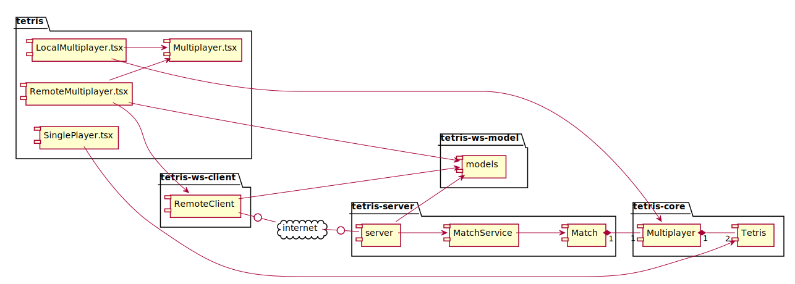
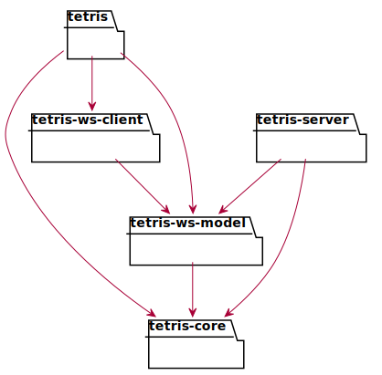
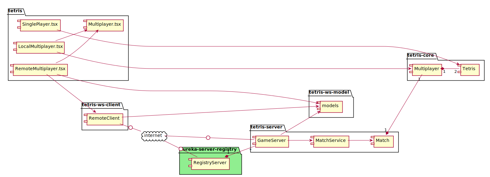

# Tetris <!-- omit in toc -->

## Overview <!-- omit in toc -->

Classic Tetris game implemented using latest web technologies. Supports single player and multiplayer (local and remote).

## Table of Contents <!-- omit in toc -->
- [Game Features](#game-features)
  - [Audio](#audio)
  - [Scoring / Level System](#scoring--level-system)
  - [Single Player](#single-player)
  - [Local Multiplayer](#local-multiplayer)
    - [High Score Battle](#high-score-battle)
    - [Attack Mode](#attack-mode)
  - [Remote Multiplayer](#remote-multiplayer)
- [Technical Solution](#technical-solution)
  - [Stack](#stack)
  - [Design](#design)
  - [Module Dependency](#module-dependency)
  - [Summary of Design Patterns / Algorithms](#summary-of-design-patterns--algorithms)
  - [Performance for Multiplayer](#performance-for-multiplayer)
  - [Misc Features for Multiplayer](#misc-features-for-multiplayer)
  - [Future Components](#future-components)
  - [Deployment](#deployment)
- [Running the App](#running-the-app)

# Game Features

## Audio

* All game modes have sound effects and background music
* Sources
  * https://opengameart.org/content/512-sound-effects-8-bit-style
  * https://commons.wikimedia.org/wiki/File:Tetris_theme.ogg

## Scoring / Level System

* Every 10 lines, the level will increase which will:
  * Increase drop speed
  * Increase the amount of points for completing lines

## Single Player

* Single player mode to play for highscore
* Tracks number of pieces, level, high score

## Local Multiplayer

### High Score Battle

* 2 players compete for the highest score. Winner is determined after both players games finish.

### Attack Mode

* 2 players compete to see who will be the last remaining player
* Ability to attack opposing player by sending random lines to opposition's playfield by getting triple or quadruple lines

## Remote Multiplayer

* Play remotely against anyone
* Players enter same match id to join the same game
* Supports both high score battle and attack mode

# Technical Solution

* Implemented using React and TypeScript
* Minimal libraries used to reduce external dependencies
* Follow object oriented programming and functional programming principles

## Stack

* TypeScript
* React
* Jest
* Lerna
* Web Sockets

## Design

The following solution overview diagram shows a subset of the components that make up the client / server Tetris game.



## Module Dependency



## Summary of Design Patterns / Algorithms

* Evolutionary architecture
  * Separation of core modules from UI implementation
  * Centralize core logic using Hexagonal architecture
  * Design allow for adding another app using a different UI framework all while reusing the same modules.
* Composition design pattern
  * Multiplayer composes Tetris game logic
  * Reuse existing game logic and add multiplayer synchronization between 2 Tetris instances
* Publish-subscribe interface
  * Allow for state changes to be pushed to clients following an event based model
* Functional programming for Tetris transformations (rotation, movement of pieces)
* Matrix maniplulation algorithms for rotations

## Performance for Multiplayer

* Game state is calculated on server and pushed to client
* Volume of message traffic was taken into design consideration
  * Push only 1 message every 50ms for game state
  * Push game events (damage, line removals, game over) to players as required as these cannot be mass generated by the user
  * Do not push game events that can be mass generated (rotations, pause in/out). Instead, generate these on the client side since these can be detected at on the client to reduce the number of messages. On local mode, components can locally subscribe to these events as there is no network overhead since it is local.

## Misc Features for Multiplayer

* Gracefully handle scenarios where players disconnects
  * Player drops or quits in the middle of the game
  * Server connectivity is lost
* Prevent players from joining a match that is already full
* Alert messages for when user joins/leaves the game

## Future Components

Since state is managed on the game server, each game server must maintain its own active games. As we horizontally scale game servers, the client will need to know how many game servers are available and what matches exist on each game server. To achieve this, a new Tetris server registry would need to be created. Using [Netflix Eureka](https://github.com/Netflix/eureka/wiki/Eureka-at-a-glance#high-level-architecture), game servers can be registered to the registry upon startup and polling interval. Updates (firewall changes) will need to be made to lock down the Eureka API to only allow readonly api calls to be made from the web client. The web client will communicate with Eureka APIs to determine which game servers are running.

This solution will allow users to browse through the list of registered game servers, and connect to the game server's APIs to view the list of active matches or join/create a match. This would allow for game servers to be scaled horizontally and allow users to find the game. 

The following diagram illustrates the changes that would made (Green indicates new):



## Deployment

* Published to Heroku
* https://hidden-tundra-30225.herokuapp.com

# Running the App

1) At the root of the project, install and build the project:
```
npm install
```
2) Go to tetris webapp project under packages/tetris and run the app:
```
npm run watch
```
3) Go to the Tetris server project under packages/tetris-server and run the server:
```
npm start
```